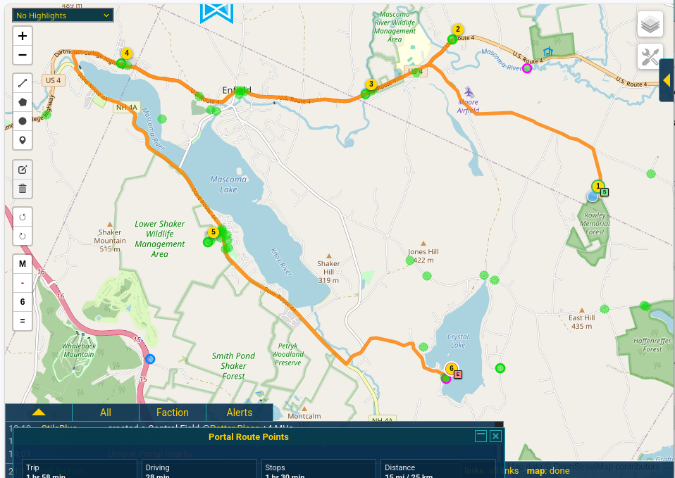
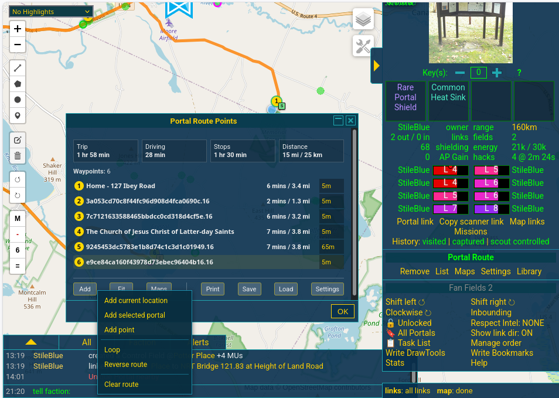
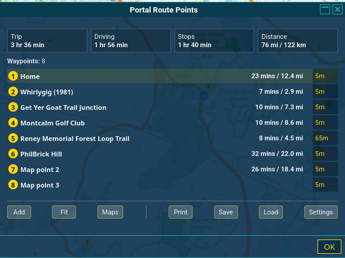
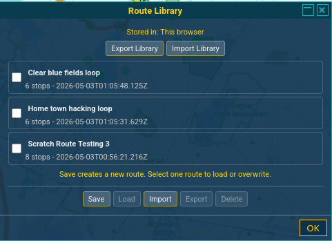
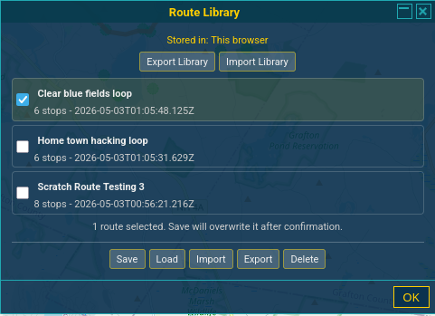
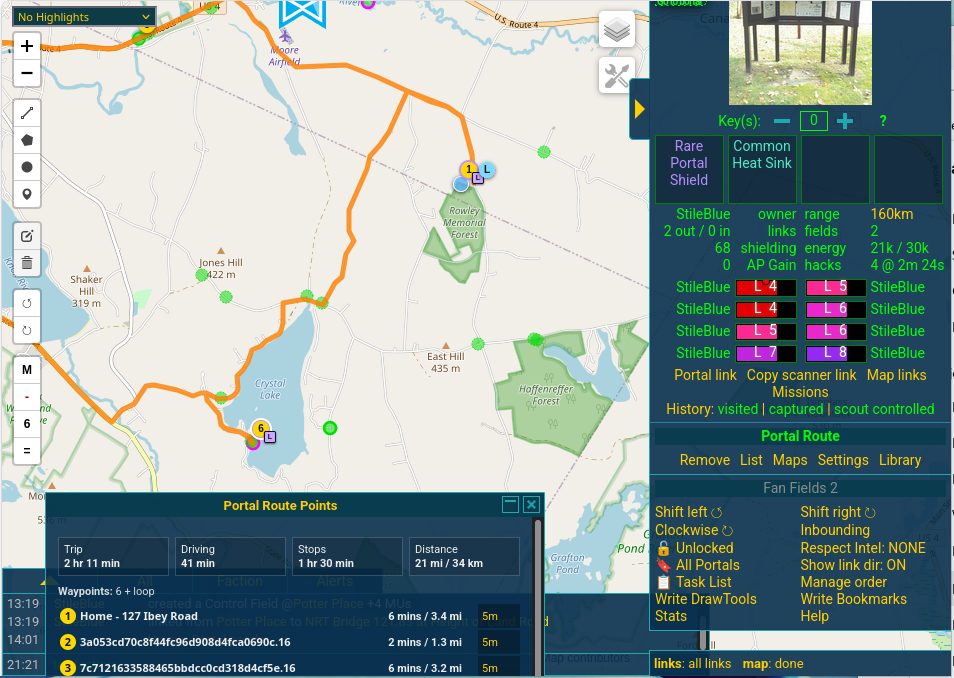
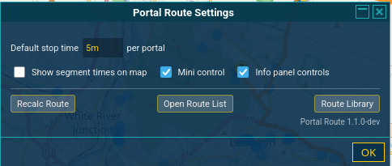

# IITC plugin: Portal Route

Portal Route is an IITC plugin for planning a driving route through selected Ingress portals and manual map points.

It is built for mobile-first use, but works on desktop IITC too. Build a stop list, account for stop time, export to a map app, or print a route summary.

## Status

Current release: `1.4.1`

This release fixes Google Drive auth setup. Portal Route no longer ships a hardcoded Drive credential, prefers IITC Sync's Google auth when available, and otherwise uses a user-configured OAuth Client ID from settings.

Large bulk-selected routes can be saved and edited, but Google routing may not plot routes with more than 26 stops in one request yet.

**Install:** [`portal-route.user.js`](https://github.com/mdiehn/iitc-plugin-portal-route/raw/refs/heads/feat/multi-modal-routing/dist/portal-route.user.js)

## Quick start

1. Select a portal in IITC.
2. Click **Add** or the mini-control **+**.
3. Add more portals, manual points, or your current location.
4. Use **Menu → Bulk select** to add portals from a circle, polygon, or Bookmarks folder.
5. Adjust stop times if needed.
6. Use **Menu**, **Print**, **Save**, or **Load** as needed.

## Route controls



Portal Route is controlled from the mini control, the route list, the settings panel, the route library, and the portal details panel.

Blue-outlined smart buttons mark the primary route controls. **Menu** opens the shared route menu. **Add**, **Del**, **Undo**, **Fit**, **Print**, **Save**, and **Load** do the named action directly.

### Points list

The points list shows the current route order. Drag rows to reorder stops, or use the compact **Up**, **Dn**, and **Del** row buttons. Right-click or long-press a row for rename and start/end actions.

**Default stop time** applies to stops that do not have their own stop time.

### Settings

- **Show segment times on map** shows per-leg labels on the route line when route data is available.

### Direct actions and Menu

- **Add** adds the selected portal, or toggles manual map-point placement when nothing addable is selected. Press **Add** again or **Esc** to cancel placement mode.
- **Del** removes the selected route waypoint.
- **Undo** reverses the last route edit.
- **Menu** opens Add me, Loop/Unloop, Clear Route, Save, Google Maps, Apple Maps, Route/Replot, Route List, Library, and Settings.



### Bulk select

**Menu → Bulk select** can add many portals at once.

- **Circle** and **Polygon** select portals currently loaded by IITC. Zoom or pan first if you expected more portals to be included.
- **Bookmarks** selects portals from IITC Bookmarks folders and uses the saved bookmark positions, so those portals do not need to be loaded on the map.
- Bulk-selected portals can be added to the current route or used to replace it.
- The preview lets you choose route start and end portals before adding/replacing the route.

Portal Route uses a simple nearest-neighbor ordering with one-step lookahead. This is not full route optimization.

Large bulk-selected routes can be saved and edited, but Google routing may not plot routes with more than 26 stops in one request yet.

### Route

- Routes calculate automatically after changes. If stale state remains, use **Menu → Route/Replot** to refresh it.
- **Menu** includes Google Maps and Apple Maps export choices. Long routes are split into stage links.
- **Print** opens a printable route summary.

When route data is available, the panels show drive time, wait time, trip time, and distance. The portal info panel shows a small abbreviated stats row under its route buttons, and stale route data is marked until the route is replotted.



### Saved routes

- **Save** stores the current route in this browser's route library.
- **Load** opens saved routes from this browser and loads the selected route.
- Saved routes can be renamed, updated from the current route, deleted, exported, and imported.
- Multiple saved routes can be selected for export or delete.
- The local route library can be exported or imported as JSON.

### Route Library

The route library stores named routes in this browser. Check one route to load, overwrite, export, or delete it. Leave routes unchecked and click **Save** to save the current route as a new entry.



With one route selected, **Save** overwrites that stored route after confirmation.



## Mini control

The mini control is for quick route actions while mostly staying on the map.


- **M** opens the map export choices.
- **L** toggles loop back to start.
- **+ / -** adds the selected portal, arms manual map-point placement, or removes the selected route waypoint.
- **count button** opens the route list.
- **=** opens the shared Menu.

## Location notes

Browser location can be very accurate on a phone and very wrong on a desktop. Desktop browsers may report the location of a network exit point instead of your real position.

Use **Menu -> Add me** when you are on the device you will actually navigate from.

## Map views

After you add enough stops, Portal Route draws the route line and fills in drive time, trip time, and distance. With **Loop** enabled, the generated loop endpoint stays numbered, and the start/end markers turn loop-blue without losing their end labels.



## Settings

The settings panel keeps general configuration and utility navigation separate from day-to-day route work.

Google Drive support uses IITC Sync's Google auth when it is already available. Otherwise, enter a Google Drive OAuth Client ID in Portal Route settings. Portal Route does not ship a Google API key or OAuth client secret for Drive.



## Main features

- Add selected portals as route stops.
- Add manual map points.
- Add your current location as a route stop.
- Optionally loop back to the first stop.
- Edit, remove, and reorder stops.
- Set a default stop time.
- Override stop time per stop.
- Use flexible stop times like `15m`, `1.5h`, and `2d`.
- Calculate a route through the stop list automatically.
- Show total drive time, wait time, trip time, and distance.
- Show per-leg time and distance in the stop list.
- Mark route data as updating after edits.
- Persist waypoints and calculated route data across IITC reloads.
- Optionally show segment time labels on the map.
- Export the route to Google Maps, with staged links for long routes.
- Export the route to Apple Maps, with staged links for long routes.
- Export and import route JSON.
- Open a printable route summary.

## Known limits

### Google Maps waypoint limit

Google Maps appears to plot the first point, final point, and up to 9 intermediate stops. That means routes with more than 11 total points may export incompletely.

Portal Route splits longer routes into multiple Google Maps stage links. Open the stages in order.

### Browser/device location

Current location depends on browser geolocation. On desktop, this may be coarse or wrong.

### Mobile hover behavior

Hover labels are limited on mobile because touch devices do not have reliable hover.

### Updating route data

Changing stops or stop times recalculates the route automatically. Totals and segment data may lag briefly while the route updates.

## Build

From the repo root:

```bash
npm run build
```

Or directly:

```bash
node build.js
```

The built userscript and metadata file are written to:

```text
dist/portal-route.user.js
dist/portal-route.meta.js
```

Syntax check:

```bash
npm run check
```

or:

```bash
node --check dist/portal-route.user.js
```

## Repository layout

```text
dist/                 built userscript files
docs/                 design notes and images
src/                  plugin source files
CHANGELOG.md          changes by milestone
README.md             this file
VERSION               current release version
build.js              build script
package.json          npm scripts and package info
```

Source changes should be made in `src/`. Files in `dist/` are build output.

For now, keep these versions in sync by hand:

```text
VERSION
src/banner.js
src/constants.js
package.json
```

## More docs

- [Design overview](docs/design.md)
- [Phase 1 design](docs/design-phase-1.md)
- [Usability notes](docs/usability-notes.md)

## Credits

Portal Route is a separate implementation inspired in part by the IITC plugins [Map Route Planner](https://softspot.nl/ingress/plugins/documentation/iitc-plugin-maps-route-planner.user.js.html), by DanielOnDiordona, and [Traveling Agent](https://github.com/yavidor/traveling-agent-plugin), by yavidor.

The Google Drive storage work follows working assumptions from the IITC [Sync plugin](https://github.com/IITC-CE/ingress-intel-total-conversion/blob/master/plugins/sync.js), by xelio.
