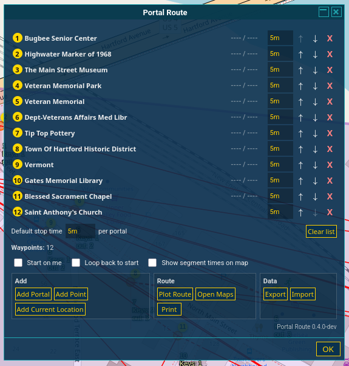
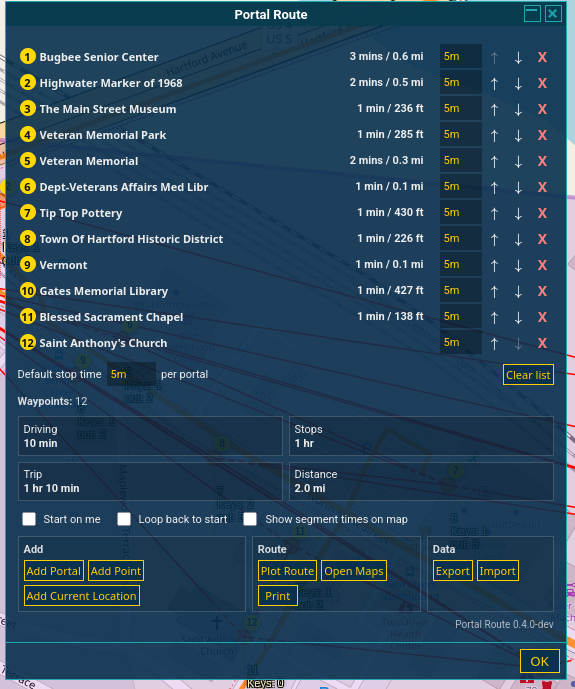
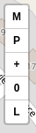
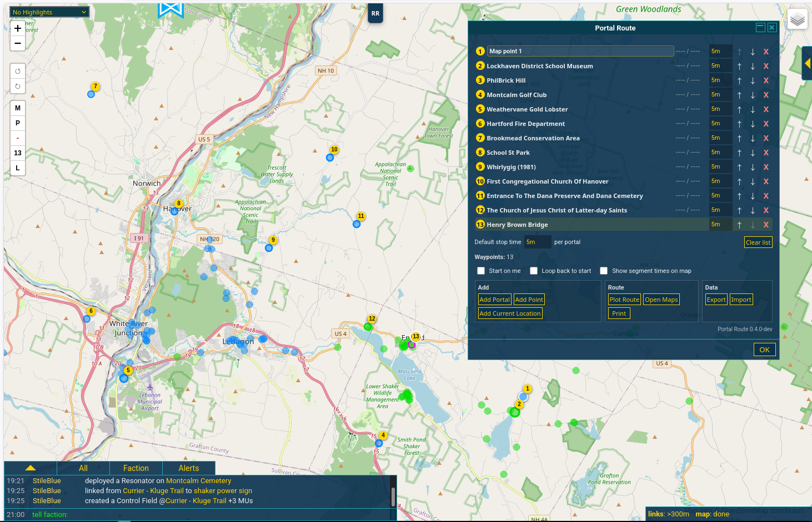
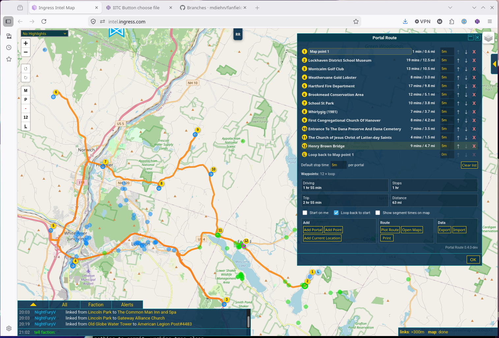
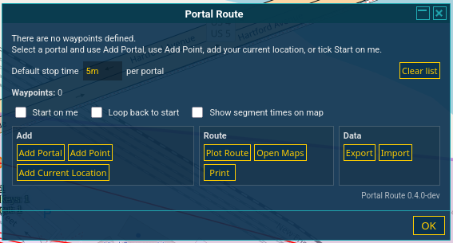

# IITC plugin: Portal Route

Portal Route is an IITC plugin for planning a driving route through selected Ingress portals and manual map points.

It is built for mobile-first use, but works on desktop IITC too. Build a stop list, plot the route, account for stop time, export to Google Maps, or print a route summary.

## Status

Current milestone: `0.5.0`

This is usable for testing and early public review. It is still a development build.

**Install:** [`portal-route.user.js`](https://github.com/mdiehn/iitc-plugin-portal-route/raw/refs/heads/main/dist/portal-route.user.js)

## Quick start

1. Select a portal in IITC.
2. Click **Add Portal**.
3. Add more portals, manual points, or your current location.
4. Adjust stop times if needed.
5. Click **Plot Route**.
6. Use **Open Maps**, **Print**, **Export**, or **Import** as needed.

## Main panel



The main panel is where you manage the route.

### Stop list

The stop list shows the current route order. Use the row controls to move or remove stops. Manual points can also be renamed.

**Default stop time** applies to stops that do not have their own stop time. **Clear list** removes the current route.

### Settings

- **Start on me** adds your current browser/device location as the first stop and keeps it first while enabled. When disabled, it leaves the route alone.
- **Loop back to start** adds a generated final stop linked to the first stop. The generated loop endpoint is labeled `L` and is not directly edited or removed.
- **Show segment times on map** shows per-leg labels on the route line when route data is available.

### Add

- **Add Portal** adds the selected portal.
- **Add Point** lets you add a manual point from the map.
- **Add Current Location** adds your current browser/device location as a normal manual point.

### Route

- **Plot Route** plots or replots the route on the IITC map.
- **Open Maps** opens the route in Google Maps. Long routes are split into stage links.
- **Print** opens a printable route summary.

When route data is available, the panel shows drive time, stop time, trip time, and distance.



### Data

- **Export** downloads the current route as JSON.
- **Import** loads a route from JSON.

## Mini control

The mini control is for quick route actions while mostly staying on the map.



- **M** opens the current route in Google Maps.
- **P** plots or replots the route.
- **+ / -** adds or removes the selected portal or manual point.
- **count button** opens the full Portal Route panel.
- **L** toggles loop back to start.

## Location notes

Browser location can be very accurate on a phone and very wrong on a desktop. Desktop browsers may report the location of a network exit point instead of your real position.

Use **Start on me** when you are on the device you will actually navigate from. Use **Add Current Location** when you want to add your location as a normal route point.

## Map views

Picked stops appear as numbered markers before routing.



After plotting, Portal Route draws the route line and fills in drive time, trip time, and distance. With **Loop back to start** enabled, the generated loop endpoint is labeled `L`.



## Empty route

After clearing the list, the panel keeps the route controls available and shows that there are no waypoints.



## Main features

- Add selected portals as route stops.
- Add manual map points.
- Add your current location as a route stop.
- Optionally keep your current location as the first stop.
- Optionally loop back to the first stop.
- Edit, remove, and reorder stops.
- Set a default stop time.
- Override stop time per stop.
- Use flexible stop times like `15m`, `1.5h`, and `2d`.
- Plot a route through the stop list.
- Show total drive time, stop time, trip time, and distance.
- Show per-leg time and distance in the stop list.
- Mark route data stale after edits.
- Show **Replot** when the route needs recalculation.
- Persist waypoints and plotted route data across IITC reloads.
- Optionally show segment time labels on the map.
- Export the route to Google Maps, with staged links for long routes.
- Export and import route JSON.
- Open a printable route summary.

## Known limits

### Google Maps waypoint limit

Google Maps appears to plot the first point, final point, and up to 9 intermediate stops. That means routes with more than 11 total points may export incompletely.

Portal Route splits longer routes into multiple Google Maps stage links. Open the stages in order.

### Browser/device location

Current location depends on browser geolocation. On desktop, this may be coarse or wrong.

### Mobile hover behavior

Hover labels are limited on mobile because touch devices do not have reliable hover.

### Stale route data

Changing stops or stop times marks the plotted route stale. Replot before trusting totals, segment data, or the route line.

## Build

From the repo root:

```bash
npm run build
```

Or directly:

```bash
node build.js
```

The built userscript and metadata file are written to:

```text
dist/portal-route.user.js
dist/portal-route.meta.js
```

Syntax check:

```bash
npm run check
```

or:

```bash
node --check dist/portal-route.user.js
```

## Repository layout

```text
dist/                 built userscript files
docs/                 design notes and images
src/                  plugin source files
CHANGELOG.md          changes by milestone
README.md             this file
VERSION               current working version
build.js              build script
package.json          npm scripts and package info
```

Source changes should be made in `src/`. Files in `dist/` are build output.

For now, keep these versions in sync by hand:

```text
VERSION
src/banner.js
package.json
```

## More docs

- [Design overview](docs/design.md)
- [Phase 1 design](docs/design-phase-1.md)
- [Usability notes](docs/usability-notes.md)

## Credits

Portal Route is a separate implementation inspired in part by the IITC plugins [Map Route Planner](https://softspot.nl/ingress/plugins/documentation/iitc-plugin-maps-route-planner.user.js.html), by DanielOnDiordona, and [Traveling Agent](https://github.com/yavidor/traveling-agent-plugin), by yavidor.
